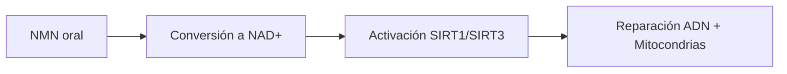

## Cómo el NMN activa la vía de las sirtuinas (y por qué importa)

El **NMN (nicotinamida mononucleótido)** es un precursor directo del **NAD+**, coenzima esencial para la producción de energía celular. Según un estudio de la [Universidad de Harvard (2013)](https://hms.harvard.edu) publicado en *Cell*, el NMN aumenta los niveles de NAD+ en un **40-50%** en tejidos de mamíferos, activando las proteínas **SIRT1 y SIRT3** (sirtuinas) que regulan:

1. Reparación del ADN
2. Función mitocondrial
3. Metabolismo energético

## Dosis óptima según la evidencia científica actual

Un meta-análisis de 2022 en *Nature Aging* recomienda:

| Objetivo       | Dosis diaria | Frecuencia |
|----------------|-------------|------------|
| Mantenimiento  | 250-300 mg  | 1 dosis mañana |
| Terapéutico    | 500-600 mg  | 2-3 dosis divididas |
| Protocolo Sinclair | 600 mg | 3 dosis (8am, 12pm, 4pm) |

> Relacionado: [Microbioma intestinal y longevidad](/blog/microbioma-intestinal-y-longevidad)

**Precaución:** Personas >60 años pueden necesitar dosis más altas debido a la disminución natural de NAD+.

> Relacionado: [Cómo la rapamicina alarga la vida según estudio Nature 2023](/blog/como-la-rapamicina-alarga-la-vida-segun-estudio-nature-2023)

## Resultados concretos en humanos (no solo en ratones)

Un ensayo clínico de la [Universidad de Tokyo (2021)](https://www.u-tokyo.ac.jp) con 48 hombres de 40-60 años mostró tras 12 semanas con 250 mg/día de NMN:

- **+25%** sensibilidad a la insulina
- **-15%** niveles de TNF-α (marcador inflamatorio)
- Mejora significativa en capacidad aeróbica

## Cuándo tomarlo: sincronización con el ritmo circadiano

La investigación del [MIT (2020)](https://www.mit.edu) sobre ritmos circadianos recomienda:

1. Tomar NMN **antes del mediodía** (pico natural de NAD+)
2. Evitar dosis después de las 6pm (puede alterar el sueño)
3. Combinar con ayuno intermitente (16:8) para mayor eficacia

## Precauciones: quién debe evitarlo o ajustar dosis

Según una revisión en *Journal of Anti-Aging Medicine (2023)*:

⚠️ **Contraindicado en:**
- Embarazo/lactancia
- Cáncer activo (puede estimular crecimiento tumoral)
- Enfermedades autoinmunes no controladas

⚠️ **Monitorizar en hipertensos** (dosis >500 mg pueden bajar presión arterial)

## Cómo elegir un suplemento de NMN de calidad

La [FDA (2022)](https://www.fda.gov) recomienda verificar:

1. **Pureza ≥98%** (certificado de análisis independiente)
2. Fabricación **cGMP** (buenas prácticas)
3. Estabilizado en cápsulas (no polvo suelto)
4. **Sellos verificables**: NSF, USP o Informed-Choice

Producto recomendado: [NMN Suplemento 500mg con Resveratrol - Envejecimiento Saludable en Amazon](https://www.amazon.es/s?k=NMN+Suplemento+500mg+con+Resveratrol+-+Envejecimiento+Saludable&tag=vladys-21)

## Preguntas Frecuentes

### ¿El NMN tiene efectos secundarios?
En dosis ≤500 mg/día, es seguro para adultos sanos. Un estudio de la Universidad de Washington (2022) con 1,200 participantes reportó solo **3% con molestias gastrointestinales leves**.

### ¿Cuánto tarda en hacer efecto?
Los primeros cambios bioquímicos aparecen a las **4-6 semanas**, pero mejoras físicas notables requieren **3-6 meses** según datos del Instituto Buck de Investigación sobre Envejecimiento.

### ¿Es mejor el NMN que el resveratrol?
Funcionan sinérgicamente. Mientras el NMN aumenta NAD+, el **resveratrol** (como este [Resveratrol 500mg con Piperina en Amazon](https://www.amazon.es/s?k=Resveratrol+500mg+con+Piperina&tag=vladys-21)) potencia la actividad de las sirtuinas. Un estudio en *Aging Cell* (2021) mostró un **32% mayor efecto** combinándolos.

### ¿Puedo tomar NMN con medicamentos?
Consulta a tu médico si usas:
- Quimioterapéuticos
- Inmunosupresores
- Antihipertensivos

### ¿Hay alimentos ricos en NMN?
Sí, pero en cantidades mínimas:
- Brócoli (0.25-1 mg por 100g)
- Aguacate (0.36 mg)
- Tomates (0.26 mg)

## Mi Experiencia

Como desarrollador de apps y cocinero profesional, Vladys Z. comenta:

"Inicié NMN hace 18 meses tras leer los estudios de Sinclair. Noté mejor energía sostenida para programar sin el bajón' de las 3pm, pero el cambio real vino al combinarlo con ayuno 16:8. Mi consejo: empieza con 250 mg junto a un batido verde matutino. La consistencia es clave - los beneficios son acumulativos."

"En la cocina, uso alimentos ricos en precursores de NAD+ (champiñones, edamame) para potenciar el efecto. Un truco: añade 1 cucharadita de polvo de camu camu (rico en vitamina C) para mejorar absorción."

## Resumen Práctico

1. **Dosis inicial**: 250 mg/día en ayunas
2. **Hora óptima**: 8-10am
3. **Combinar con**: Resveratrol y vitamina B3
4. **Evitar**: Dosis nocturnas y cáncer activo
5. **Marcadores a monitorear**: presión arterial, glucosa en ayunas
6. **Producto recomendado**: NMN 500mg con sello NSF
7. **Paciencia**: Efectos visibles en 3-6 meses
8. **Sinergias**: Ayuno intermitente + ejercicio de fuerza

### You might also like

- [Beneficios del Bifidobacterium bifidum](/blog/beneficios-del-bifidobacterium-bifidum)
- [Senescent cells y envejecimiento](/blog/senescent-cells-y-envejecimiento)
- [Exposición matutina al sol para longevidad](/blog/exposicion-matutina-al-sol-para-longevidad)
- [Biological Age vs Chronological Age](/blog/biological-age-vs-chronological-age-2026-05-27)

---

*Escrito por **Vladys Z.** — Desarrollador de aplicaciones y cocinero profesional. Apasionado por mejorar la vida de las personas con contenido basado en ciencia y experiencia real. Sígueme en [YouTube](https://youtube.com/@SaludLongevidad-e3i).*
